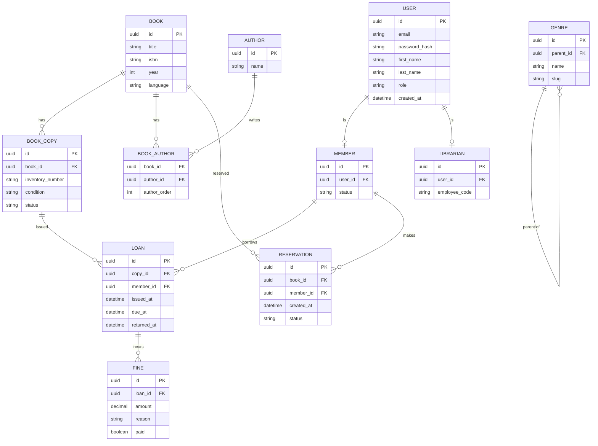

# ER-діаграма бібліотеки

```mermaid
erDiagram
    BOOK ||--o{ BOOK_COPY : has
    BOOK ||--o{ BOOK_AUTHOR : has
    AUTHOR ||--o{ BOOK_AUTHOR : writes
    BOOK_COPY ||--o{ LOAN : issued
    MEMBER ||--o{ LOAN : borrows
    MEMBER ||--o{ RESERVATION : makes
    BOOK ||--o{ RESERVATION : reserved
    LOAN ||--o{ FINE : incurs
    GENRE ||--o{ GENRE : "parent of"
    USER ||--o| MEMBER : is
    USER ||--o| LIBRARIAN : is

    BOOK {
        uuid id PK
        string title
        string isbn
        int year
        string language
    }

    BOOK_COPY {
        uuid id PK
        uuid book_id FK
        string inventory_number
        string condition
        string status
    }

    AUTHOR {
        uuid id PK
        string name
    }

    BOOK_AUTHOR {
        uuid book_id FK
        uuid author_id FK
        int author_order
    }

    USER {
        uuid id PK
        string email
        string password_hash
        string first_name
        string last_name
        string role
        datetime created_at
    }

    MEMBER {
        uuid id PK
        uuid user_id FK
        string status
    }

    LIBRARIAN {
        uuid id PK
        uuid user_id FK
        string employee_code
    }

    LOAN {
        uuid id PK
        uuid copy_id FK
        uuid member_id FK
        datetime issued_at
        datetime due_at
        datetime returned_at
    }

    RESERVATION {
        uuid id PK
        uuid book_id FK
        uuid member_id FK
        datetime created_at
        string status
    }

    FINE {
        uuid id PK
        uuid loan_id FK
        decimal amount
        string reason
        boolean paid
    }

    GENRE {
        uuid id PK
        uuid parent_id FK
        string name
        string slug
    }
```