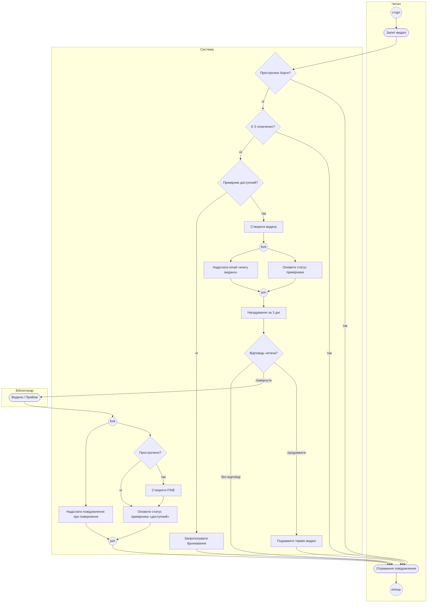

# Activity-діаграма: позичення книги

```mermaid
flowchart TB
    subgraph Reader["Читач"]
        START((старт))
        R1([Запит видачі])
        R2([Отримання повідомлення])
        STOP((кінець))
    end
    subgraph System["Система"]
        S1a{Прострочені борги?}
        S1b{Є 5 позичених?}
        S2{Примірник доступний?}
        S3[Створити видачу]
        F1((fork))
        S4[Оновити статус примірника]
        S5[Надіслати email «книгу видано»]
        J1((join))
        S6[Нагадування за 3 дні]
        S7{Відповідь читача?}
        S9[Запропонувати бронювання]
        S14[Подовжити термін видачі]
        F2((fork))
        S10{Прострочено?}
        S11[Створити FINE]
        S12[Надіслати повідомлення про повернення]
        S13[Оновити статус примірника «доступний»]
        J2((join))
    end
    subgraph Librarian["Бібліотекар"]
        L1([Видача / Прийом])
    end

    START --> R1
    R1 --> S1a
    S1a -- так --> R2
    S1a -- ні --> S1b
    S1b -- так --> R2
    S1b -- ні --> S2
    S2 -- так --> S3
    S2 -- ні --> S9
    S3 --> F1
    F1 --> S4
    F1 --> S5
    S4 --> J1
    S5 --> J1
    J1 --> S6
    S6 --> S7
    S7 -- продовжити --> S14
    S14 --> R2
    S7 -- повернути --> L1
    L1 --> F2
    F2 --> S10
    F2 --> S12
    S10 -- так --> S11
    S11 --> S13
    S13 --> J2
    S10 -- ні --> S13
    S12 --> J2
    J2 --> R2
    S7 -- без відповіді --> R2
    S9 --> R2
    R2 --> STOP
```