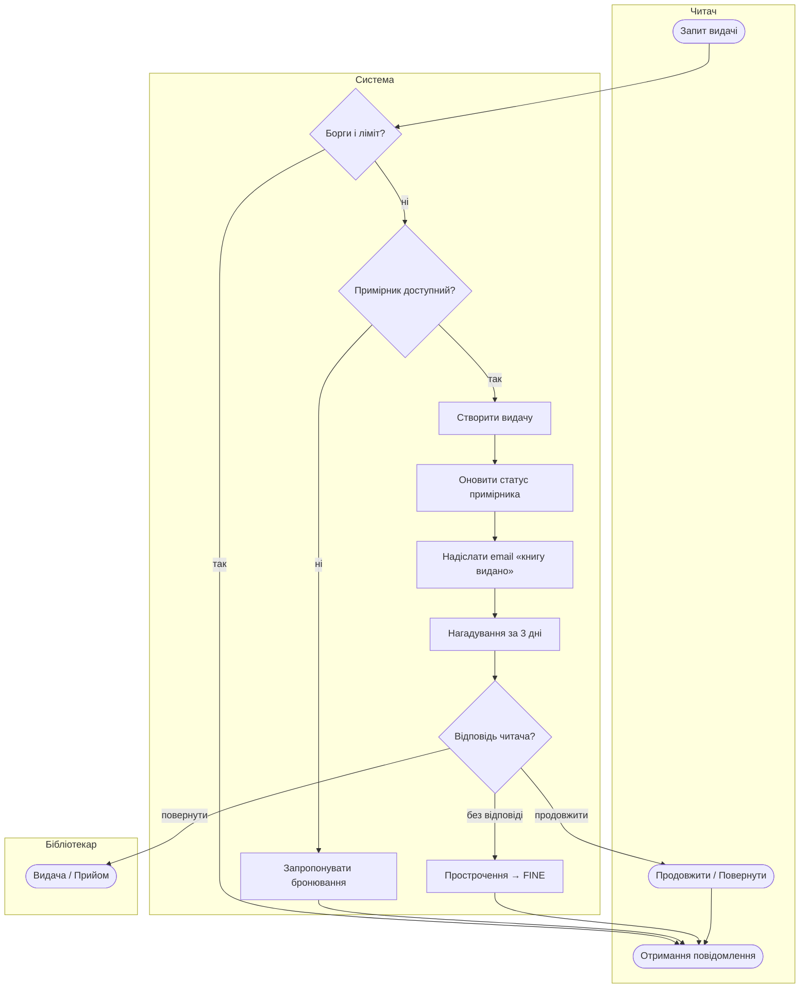

# Activity-діаграма: позичення книги

```mermaid
flowchart TB
    subgraph Reader["Читач"]
        R1([Запит видачі])
        R2([Отримання повідомлення])
        R3([Продовжити / Повернути])
    end
    subgraph System["Система"]
        S1{Борги і ліміт?}
        S2{Примірник доступний?}
        S3[Створити видачу]
        S4[Оновити статус примірника]
        S5[Надіслати email «книгу видано»]
        S6[Нагадування за 3 дні]
        S7{Відповідь читача?}
        S8[Прострочення → FINE]
        S9[Запропонувати бронювання]
    end
    subgraph Librarian["Бібліотекар"]
        L1([Видача / Прийом])
    end

    R1 --> S1
    S1 -- ні --> S2
    S1 -- так --> R2
    S2 -- так --> S3
    S2 -- ні --> S9
    S3 --> S4
    S4 --> S5
    S5 --> S6
    S6 --> S7
    S7 -- продовжити --> R3
    S7 -- повернути --> L1
    S7 -- без відповіді --> S8
    S9 --> R2
    S8 --> R2
    R3 --> R2
```