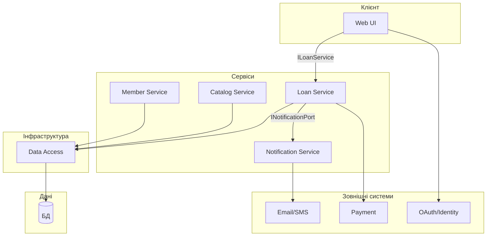

# Component Diagram: архітектура бібліотеки

```mermaid
flowchart TB
    subgraph Client["Клієнт"]
        WebUI["Web UI"]
    end
    subgraph Services["Сервіси"]
        CatalogService["Catalog Service"]
        LoanService["Loan Service"]
        MemberService["Member Service"]
        NotificationService["Notification Service"]
    end
    subgraph Infra["Інфраструктура"]
        DataAccess["Data Access"]
    end
    subgraph Data["Дані"]
        DB[("БД")]
    end
    subgraph External["Зовнішні системи"]
        EmailSMS["Email/SMS"]
        Payment["Payment"]
        OAuth["OAuth/Identity"]
    end

    WebUI -->|ILoanService| LoanService
    LoanService -->|INotificationPort| NotificationService
    LoanService --> DataAccess
    CatalogService --> DataAccess
    MemberService --> DataAccess
    DataAccess --> DB
    NotificationService --> EmailSMS
    LoanService --> Payment
    WebUI --> OAuth
```